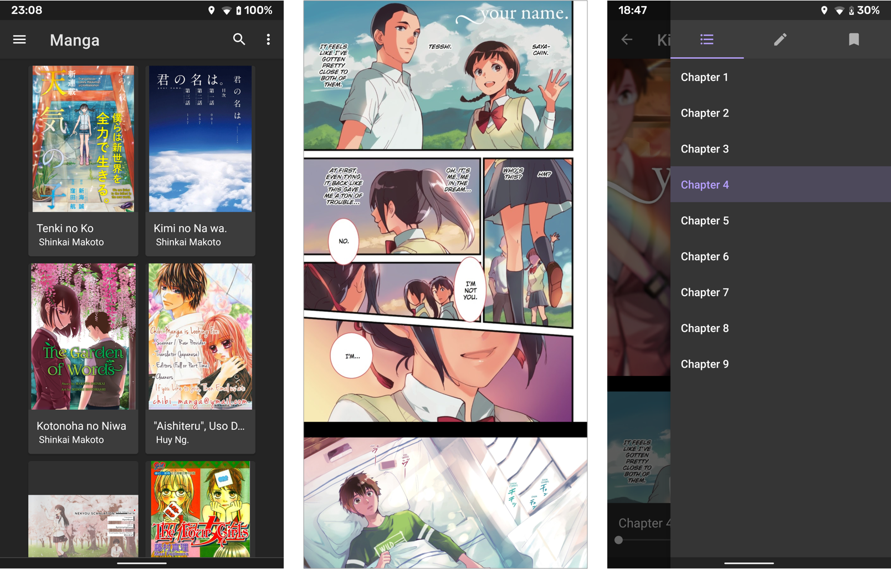

# Kissmanga Downloader

_A word from the original repo's author:_

> Don't wanna right click and save as image for every single page of your favorite manga on KissManga?
> Automatically download all the manga instead! Inspired by [this](https://github.com/aviaryan/Kissanime-Batch-Downloader), manga should be downloadable as well.

Simply, you give _Kissmanga Downloader_ the link to your favorite manga, and it will take care of all downloading and packing, and return you an **EPUB** file that you can read anywhere on your smartphones.

Here is how the manga look like in [_Lithium_](https://play.google.com/store/apps/details?id=com.faultexception.reader) app.

**Before using this script, read [TERMS OF USING](terms-of-using.md).**

## _Kissmanga Downloader_ can

- [x] Download and pack manga into **EPUB** files.
- [x] Chapter mark manga **EPUB** files.
- [ ] Minimize created **EPUB** file size.
- [ ] Run as a CLI command like _youtube-dl_

## Usage

_Kissmanga Downloader runs on [Docker](https://docs.docker.com/get-docker/) containers and uses [Maven](http://maven.apache.org/install.html) as build tool, so you should have them installed._

1. Put the url of the manga you want to download from kissmanga.com (i.e. http://kissmanga.com/Manga/Shingeki-no-Kyojin) on line 16 of the docker-compose.yml file.
2. Run `make go`.
3. You can also decide the manga title, authors, and cover image by editing the corresponding tags in `manga.xml` at `<current-working-directory>/output/<your-manga-directory>`. The downloaded png files along with those metadata will automatically be packed into a single **EPUB** file when the downloading finishes.

Each manga is downloaded as a separate directory under their names and their **EPUB** files will be located at `<current-working-directory>/output`.

## How it Works

Selenium is used to control a firefox browser running in a docker container, in order to render the manga pages, and retrieve all image urls. The images are then downloaded en masse and packed into a epub file.
Currently only supports `kissmanga.com`, no support yet for `kissmanga.io`, and other tld variants yet.
