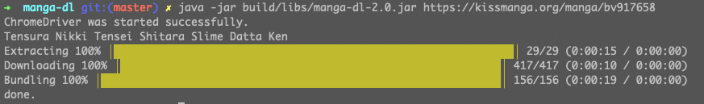

# manga-dl
Need a tool to fetch those manga you love quickly, you hate advertisement and don't like to read online. Don't worry, _manga-dl_ got your back. _manga-dl_ will get your favorite manga from [Kissmanga](https://kissmanga.org/) straight into your computer, and you can read them on whatever device you have as long as it's **EPUB** compatible.

Simply put, with a single command _manga-dl_ downloads your manga and automatically bundles it into a portable EPUB file that you can read whenever you want without the internet.

Here is how the downloaded manga look like when you import them into [_Lithium_](https://play.google.org/store/apps/details?id=com.faultexception.reader) app. This is just for the demo, any app that supports reading **EPUB** file works just fine


**Before using this script, read [TERMS OF USING](terms-of-using.md).**

## Features

- [x] _youtube-dl_-like command line interface.
- [x] Chapter-mark **EPUB** bundling.
- [ ] Multithreading image downloading.
- [ ] PDF bundling.
- [ ] Compressed **EPUB**  bundling.
- [ ] Dockerized execution. 
- [ ] Other sites support.

## Setup

_manga-dl_ is a command line tool written in Java, so of course you need Java to run it. Grab one [here](https://www.oracle.com/java/technologies/javase-jre8-downloads.html)

> The current version is under development, you also need to have [Google Chrome](https://www.google.com/chrome/) installed

1. Clone the repo
```
git clone https://github.com/giahuy2201/manga-dl.git
```
2. Navigate to the project folder
```
cd manga-dl
```
3. Build the project using `./gradlew`
```
./gradlew clean jar
```
You now have successfully built your `manga-dl-2.0.jar`.

## Usage

Before continue, make sure you have `chromedriver` in the project foler as well as Google Chrome installed.
You can now start executing your command by prompting it with `java -jar build/libs/manga-dl-2.0.jar`. Here is the help message.
```
Usage: manga-dl [-hlv] [URL] [COMMAND]
      [URL]       Link to manga.
  -h, --help      Show this help message.
  -l, --log       Save log file.
  -v, --verbose   Enable console log
Commands:
  download  Only download image files (.png).
  bundle    Pack image files (.png) into an EPUB file
```

### Examples

Download and pack manga
```
java -jar build/libs/manga-dl-2.0.jar https://kissmanga.org/manga/bv917658
```


Download and save image files
```
java -jar build/libs/manga-dl-2.0.jar download https://kissmanga.org/manga/bv917658
```
Bundle images files into an EPUB file
```
java -jar build/libs/manga-dl-2.0.jar bundle 'Tensura Nikki Tensei Shitara Slime Datta Ken'
```

_manga-dl_  first downloads and stores your manga frames int a folder under the manga's title in `.png` format. It then collects all the frames and bundle them into an EPUB file. In addition, it saves your manga's metadata as well as all the frames' urls in `manga.xml` located at the manga directory for later bundling options. The EPUB file of your manga is generated right at the project folder, the manga folder can be deleted safely afterward.

## How it works

_manga-dl_ uses Selenium to control your Chrome browser to access your manga url and collect all the manga's frames. The manga frames' urls as well as other metadata about the manga is saved. After that _manga-dl_ downloader goes through all the frames' urls and retrieve them. Finally, _manga-dl_ bundler kicks in and create an EPUB file.

## Disclaimer

Manga piracy is an act of stealing which is _illegal_, using _manga-dl_ for non-personal purposes is discouraged. _manga-dl_ is made for the sole purpose of education, its creator will NOT be responsible for any consequences.
